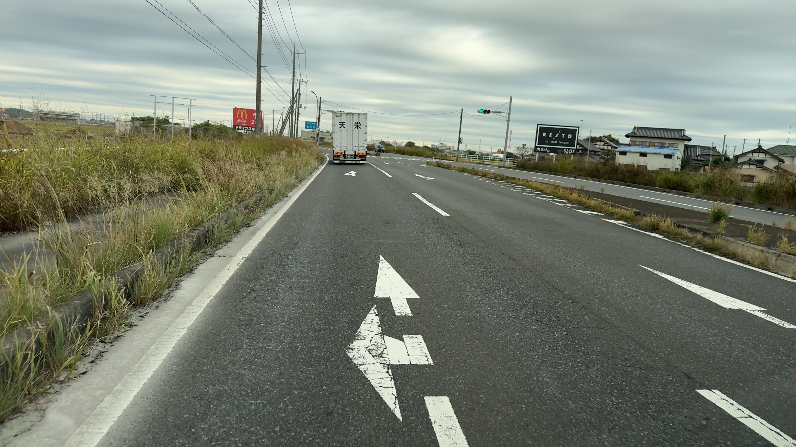

# 📘 **StereoVisionToolkit — Road Rut Depth Measurement (mm accuracy)**

A complete stereo-vision processing pipeline for **millimeter-level rut depth estimation** using smartphone stereo images or any calibrated stereo camera pair.
This project includes a fully modular architecture, robust rectification for **non-synchronized stereo cameras**, accurate 3D reconstruction, and multi-stage rut-shape extraction.

---

# 🖼️ Example Input/Output

### **Input Images**

|                                 Left camera                                 |                                 Right camera                                |
| :-------------------------------------------------------------------------: | :-------------------------------------------------------------------------: |
|  |  |

---

### **Rectified Output**

(Automatically corrected to avoid cropping and preserve full FOV)


---

### **Final Rut Depth Result**


---

# 🚀 Overview

This toolkit implements an end-to-end geometric vision pipeline:

1. **Stereo Rectification (robust for non-synchronized cameras)**
2. **SGBM-based disparity computation (auto-tuned parameters)**
3. **3D reconstruction using corrected Q matrix**
4. **Rut profile extraction (slope correction, filtering, baseline alignment)**
5. **Final rut depth measurement in millimeters**

The system is designed to be:

* Engineering-accurate
* Modular and extensible
* Suitable for research, road-inspection prototyping, or 3D reconstruction tasks

---

# 🎯 Key Features

### ✔ **1. Robust Stereo Rectification for Non-Synchronized Cameras**

Standard `cv2.stereoRectify()` assumes synchronized stereo inputs.
Real smartphone captures often violate this assumption due to:

* Time lag between left/right images
* Moving objects on the road
* Camera motion
* Vertical/horizontal parallax
* FOV mismatch

This project implements an enhanced rectification pipeline:

#### Improvements:

* Auto-calculation of minimal bounding box to prevent FOV loss
* Correction of rectification parameters (`alpha`, scaling, ROI)
* Recalculation of projection matrices (P1/P2) with shifted principal points
* Regeneration of Q matrix for metric-accurate reconstruction
* Guaranteed full-frame rectification even with time-lagged pairs

These corrections enable stable disparity estimation and accurate 3D reconstruction.

---

### ✔ **2. Auto-Tuned SGBM Disparity**

Automatically determines `numDisparities` and SGBM parameters based on:

* baseline
* focal length (pixels)
* expected depth range
* target accuracy

Provides:

* dense disparities
* sub-pixel refinement
* noise suppression for road surfaces

---

### ✔ **3. Metric-Accurate 3D Reconstruction**

Using the corrected Q matrix, the system produces:

* millimeter-level world coordinates
* ground-plane alignment (XYZ rotation)
* consistent metrics regardless of input resolution

---

### ✔ **4. Multi-Stage Rut Profile Extraction**

Includes:

* Outlier removal (MAD-based)
* Slope correction
* Baseline normalization
* Optional low-pass filtering
* Final rut depth using geometric intersection

All intermediate results can be saved for debugging or research.

---

# 🧠 Processing Pipeline

```
Left/Right Images
        ↓
[Rectification Engine]
        ↓
[SGBM Disparity Engine]
        ↓
[3D Reconstruction]
        ↓
[Rut Shape Processing]
        ↓
Final Rut Depth (mm)
```

---

# 📂 **Repository Structure**

*(Extracted from structure.txt — faithfully reflected)*


```
StereoVisionToolkit/
├── main.py                          # Entry point, orchestrates the full pipeline

├── config/
│   ├── config.py                    # Configuration loader and validator
│   ├── config_rut_shape.json        # Main rut shape configuration
│   └── config_rut_shape1.json       # Alternative configuration

├── src_rut_shape/
│   ├── rut_shape.py                 # High-level rut extraction pipeline
│   ├── rectify_refactored.py        # Stage 1: Stereo rectification (improved)
│   ├── disparity_refactored.py      # Stage 2: Disparity calculation (SGBM)
│   ├── depth.py                     # Stage 3: 3D reconstruction
│   ├── height_refactored.py         # Stage 4: Rut shape extraction

│   ├── base/
│   │   ├── file_manager.py          # File I/O operations
│   │   └── processor.py             # Template for pipeline processors

│   ├── rectification/
│   │   ├── engine.py                # Core rectification engine
│   │   ├── matrix_calculator.py     # P1/P2/Q matrix correction
│   │   └── file_manager.py          # Rectification file I/O

│   ├── disparity/
│   │   ├── sgbm_engine.py           # SGBM computation engine
│   │   ├── parameter_calculator.py  # Auto-parameter tuning
│   │   └── disparity_processor.py   # Post-processing (sub-pixel, filtering)

│   └── height/
│       ├── processors.py            # Profile filtering, slope correction
│       ├── rut_calculator.py        # Final rut depth estimation
│       ├── image_loader.py          # Image and data loader
│       ├── coordinate_processor.py  # Coordinate frame alignment (XYZ rotation)
│       └── file_manager.py          # File operations for height stage

├── utils/
│   ├── point_processor.py           # Geometric utilities
│   ├── image_processing.py          # Image manipulation helpers
│   ├── low_pass_filter.py           # Signal filtering
│   ├── data_scaling.py              # Coordinate scaling helpers
│   ├── rut_visualization.py         # Rut plotting utilities
│   ├── visualizer.py                # Misc visualization
│   ├── stereo_math.py               # Stereo geometry calculations
│   ├── file_operations.py           # File I/O
│   └── logger_config.py             # Logging configuration

└── document/
    ├── README.md                    # User guide (this file)
    ├── PROJECT_DEEP_DIVE.md         # Technical deep dive
    └── TECHNOLOGY_TRANSFER.md       # Implementation documentation
```

---

# ▶ How to Run

```
python main.py --config config/config_rut_shape.json
```

Inputs:

* left/right images
* calibration parameters (K1, K2, d1, d2, R, T)
* seed points for rut-line interpolation

Outputs:

* disparity map
* 3D world coordinates
* rut profile
* final rut depth (mm)

---

# 🧪 Applications

* Road surface inspection
* Infrastructure monitoring
* Stereo depth estimation research
* Smartphone-based 3D measurement
* Geometry-based computer vision experimentation

---